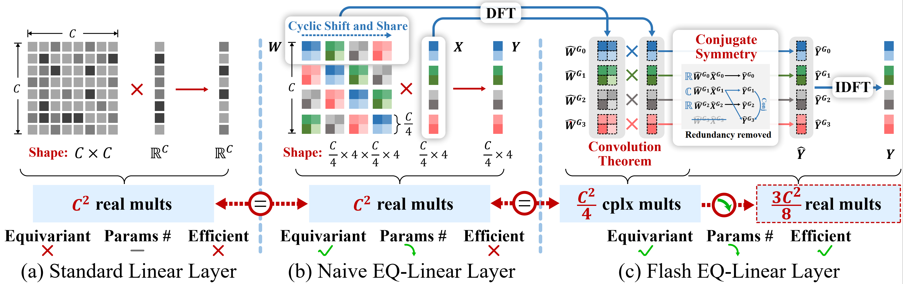
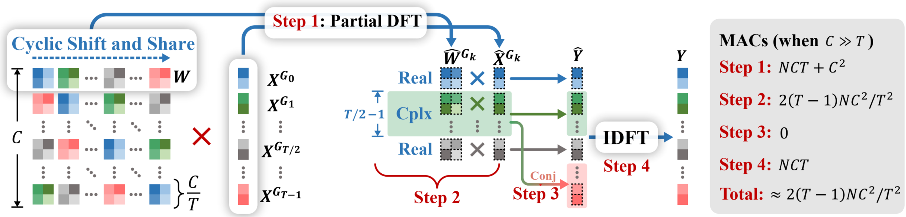
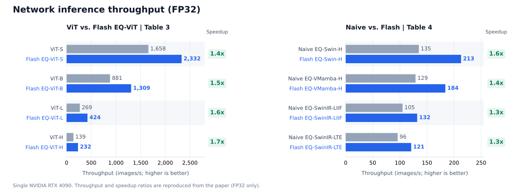
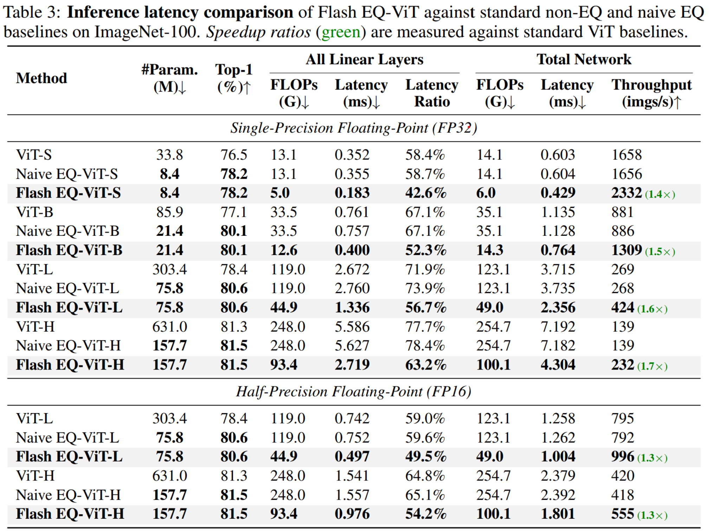

# Flash EQ-Linear

✨ Official implementation of **Flash EQ-Linear: Accelerating Equivariant Linear Layers via Group Fourier Transform** 

**🤗 Don't hesitate to give us a ⭐️ if you are interested in this project!**

[](https://arxiv.org/abs/2607.21271)


## 💡 Introduction

**🎯 TL;DR:** Flash EQ-Linear accelerates rotation-equivariant linear layers by applying the Fourier transform along the group dimension. For the **p4 group (90-degree rotations)**, it achieves a theoretical speedup of **2.67×**, delivering measured speedups of up to **2.1× for operator-level forward passes** and **1.7× for end-to-end network inference**.






**⚡ Acceleration Principle:** By applying the DFT convolution theorem along the group dimension, group-circulant convolution (requiring `NDC` MACs) transforms into elementwise multiplication in the Fourier domain (reducing to `NDC/T` MACs):


Since input features `X` and weights `W` are real-valued, their Fourier coefficients satisfy $F(X)_{T-k} = \overline{F(X)_k}$. We exploit this symmetry to compute only half of the frequency components, further reducing computation by **~2×**.


**🔥 Key Highlights**

- **Hand-crafted CUDA Kernels** - Extensively optimized custom CUDA implementations for both FP32 and FP16
- **Exactness and equivariance preservation** - Maintains mathematical correctness while achieving significant speedups
- **Scalability** - Speedup scales linearly with group size; larger groups benefit more
- **Training-free and plug-and-play** - Drop-in replacement for existing equivariant linear layers


**⚙️ Engineering Effort**

This project represents **substantial CUDA kernel engineering work**:

- **Custom FP32/FP16 kernels** built from scratch with extensive low-level optimizations
- **Memory access pattern optimization** - Coalesced global memory access, efficient shared memory usage
- **Compute-bound optimization** - Tensor Core utilization (for FP16), instruction-level parallelism
- **CUTLASS template integration** - Leveraging NVIDIA's high-performance GEMM templates for FP16 implementation
- **Multi-precision support** - Separate kernel implementations optimized for different precision requirements
- **Extensive validation** - Numerical correctness verification across various input sizes and configurations

The CUDA kernel development involved careful profiling, iterative optimization, and validation to achieve near-theoretical speedup limits.


## 📊 Results

The following results are measured on a single **NVIDIA RTX 4090 (24 GB) / Ada (SM 89)**. 

### Operator-Level Acceleration


### Network-Level Acceleration






## 🚀 Quick Start

### 1. Requirements

Recommended conda environment:

```bash
conda create -n eqflash python=3.10.14 -y
conda activate eqflash

pip install torch==2.4.0 torchvision==0.19.0 torchaudio==2.4.0 --index-url https://download.pytorch.org/whl/cu124

pip install timm==0.6.12 tqdm==4.65.2 opencv-python==4.11.0.86 matplotlib==3.10.3 einops==0.8.1 addict==2.4.0 yacs==0.1.8 fvcore==0.1.5.post20221221 ftfy==6.3.1 tensorboard==2.20.0

# Optional: for Flash EQ-Mamba (download wheels first)
# pip install causal_conv1d-1.4.0+cu122torch2.4cxx11abiFALSE-cp310-cp310-linux_x86_64.whl;
# pip install ./mamba_ssm-2.2.2+cu122torch2.4cxx11abiFALSE-cp310-cp310-linux_x86_64.whl;
```


### 2. Compile CUDA kernels

```bash
python kernels/setup.py
```

**Note:** FP16 kernel compilation requires [CUTLASS](https://github.com/NVIDIA/cutlass) headers (included in `kernels/flash_eqlinear_fp16/cutlass/`). The compilation process builds:

- `flash_EQLinear_cuda_direct_gemm_fp32_ada4090.so` - Optimized FP32 kernel

- `flash_EQLinear_fp16_direct_gemm_release_ada4090.so` - Tensor Core-accelerated FP16 kernel

  

### 3. 🧩 Plug-and-Play Usage

Replace standard equivariant linear layers with Flash EQ-Linear:

```python
# Add import at the top
try:
    from kernels.flash_eqlinear_fp32.flash_EQLinear_fp32_direct_gemm_ada4090 import CudaFlashEQLinearDirectGemmAda4090 as FlashEQLinear
except Exception:
    from models.kernels.flash_eqlinear_fp32.flash_EQLinear_fp32_direct_gemm_ada4090 import CudaFlashEQLinearDirectGemmAda4090 as FlashEQLinear

# Replace EQLinearInter with FlashEQLinear
# Before:
# self.eq_linear = EQLinearInter(in_dim, out_dim, tranNum=4, bias=True)

# After:
self.eq_linear = FlashEQLinear(in_dim, out_dim, tranNum=4, bias=True)
```

That's it! Flash EQ-Linear is a drop-in replacement that maintains exact equivariance while providing significant speedups.


### 4. Speed Test - Single Layer

Test operator-level performance:

```bash
cd flash_eq_linear

# FP32 precision
python test_speed_fp32.py

# FP16 precision
python test_speed_fp16.py
```


### 5. Speed Test - Full Networks

Test end-to-end network performance:

```bash
cd flash_eq_network

# EQ-ViT (--scales: "tiny", "small", "base", "large", "huge"; --precision: "fp32", "fp16")
python plain_vit.py --scale base --precision fp32 --batch-size 128
python eq_vit.py --scale base --precision fp32 --batch-size 128
python flash_eq_vit.py --scale base --precision fp32 --batch-size 128

# EQ-Swin
python plain_swin.py
python eq_swin.py
python flash_eq_swin.py

# EQ-VMamba
python plain_vmamba.py
python eq_vmamba_v2.py
python flash_eq_vmamba_v2.py

# EQ-INR (Implicit Neural Representations)
python eq_swinir_liff.py
python flash_eq_swinir_liff.py

python eq_swinir_lte.py
python flash_eq_swinir_lte.py
```


### 6. Precision Validation

Verify numerical correctness:

```bash
cd flash_eq_linear

python test_precision_fp32.py
python test_precision_fp16.py
```


## 🏗️ Implementation Details

**CUDA Kernel Architecture** 

Our implementation features **hand-optimized CUDA kernels** designed for maximum performance:

- **FP32 Kernel (`flash_eqlinear_fp32/`):**
  - Direct GEMM implementation with manual memory management
  - Optimized for NVIDIA Ada Lovelace architecture (RTX 4090)
  - Coalesced memory access patterns for bandwidth efficiency
  - Thread block configuration tuned for occupancy
- **FP16 Kernel (`flash_eqlinear_fp16/`):**
  - Built on CUTLASS templates for Tensor Core acceleration
  - Exploits half-precision Tensor Core throughput (up to 330 TFLOPS on RTX 4090)
  - Warp-level matrix operations with efficient data layout
  - Mixed-precision computation with FP32 accumulation

**Key Optimizations**

- **Group-wise Fourier Transform in Frequency Domain** - Mathematical reformulation reduces computation from O(16×) to O(4×) for p4 group

- **Fused Kernel Operations** - Minimizes global memory traffic by fusing transformation and GEMM

- **Register-Level Optimization** - Careful register allocation to maximize occupancy

- **Shared Memory Tiling** - Optimized tile sizes for cache efficiency

- **Instruction-Level Parallelism** - Maximizing instruction throughput through careful scheduling


## 💌 Acknowledgements

This project is built using [PyTorch](https://pytorch.org/), [CUTLASS](https://github.com/NVIDIA/cutlass), [timm](https://github.com/huggingface/pytorch-image-models) libraries, and borrows code from [Equivariant-ASISR](https://github.com/XieQi2015/Equivariant-ASISR), [EQ-VMamba](https://github.com/zhongchenzhao/EQ-VMamba), and other equivariant vision repositories. We express our heartfelt gratitude for the contributions of these open-source projects.

**Special acknowledgment:** The CUDA kernel development in this project represents months of dedicated low-level optimization work, profiling, and validation to achieve production-grade performance. We thank all participants for their contributions to CUDA kernel optimization.


## 📄 License

This project is released under the Apache 2.0 license. Please see the [LICENSE](LICENSE) file for more information.


## 🔗 Citation

If you use Flash EQ-Linear in your research, please cite:

```bibtex
@article{zhao2026flash,
  title={Flash EQ-Linear: Accelerating Equivariant Linear Layers via Group-wise Discrete Fourier Transform},
  author={Zhao, Zhongchen and Wang, Jixin and Xie, Qi and Lin, Hui and Zhang, Lei and Meng, Deyu and Xu, Zongben},
  journal={arXiv preprint arXiv:2607.21271},
  year={2026}
}
```
